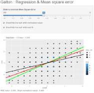

```{r setup, include=FALSE}
knitr::opts_chunk$set(echo = FALSE)
```


## Galton invented Regression
Francis Galton, the 19th century polymath, can be credited with discovering
regression.

In his landmark paper Regression Toward Mediocrity in Hereditary 
Stature he was particularly interested in the idea that the children's height was
highly correlated to their parent's height but for extreme cases (very tall or very small) a bit less tall or short.

He referred to this as "regression to mediocrity" (or regression to the mean). In quantifying regression to the mean, he invented what we would call regression.

## Comparing children's & parent's height
Let's plot parent & child heights to see how they relate to each other.

```{r plotgalton, echo = FALSE, message=FALSE, warning=FALSE}
library(plotly)
library(UsingR)

plot_ly(galton, x = ~parent, y = ~child, type = "scatter", mode = 'markers')
```

## Regression through the origin
if Yi is ith childs height, Xi is ith avg parents heights the correlation between children's height and parent's height is given by :

                         Yi = β0 + β1*Xi
             with min: Σ{Yi - (β0 + β1*Xi)}^2

A line requires two parameters to be specified, the intercept and the slope. 
Let's first focus on the slope. We want to find the slope of the line that best 
fits the data. 

To get the line to pass by the origin and get rid of β0 let's subtract the mean
from both the parent and child heights so that their subsequent means are 0.

## Minimize mean square error
The plot in https://gljapp.shinyapps.io/pa8_c9s4/ shows the distribution between parent's height
(x axis) and children's height and permit to adjust (slider) the slope in order 
to minimize the mean square error.
In addition two checkboxes permit to show :

- the line (green) representing normalized data ie 
      (data - mean) / standard deviation
      
- the line (red) representing the best fit ie 
      lm(I(child - mean(child))~ I(parent - mean(parent)) - 1, data = galton)



